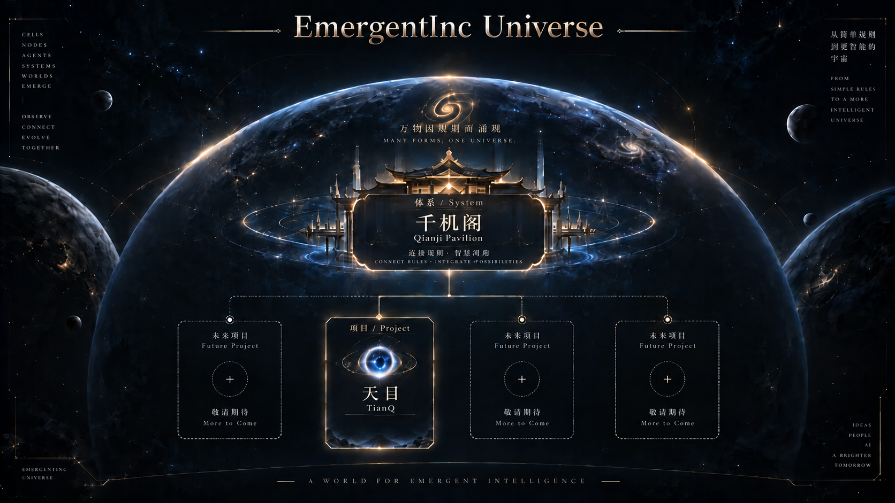

# 天目 · TianQ 千机阁 · 天机演化之目

TianQ 是一个围绕多智能体市场行为展开的实验项目。

它尝试把市场理解为一个由大量不同参与者共同形成的动态系统。

传统量化往往从 价格 → 模式 → 预测

TianQ 更关注另一条路径：

> **不假设能够“预知市场”，而是探索:**
> **能否通过模拟大量异质市场参与者，观察价格形成当下的群体行为结构。**

**Repository:**  
https://github.com/lx00018310/TianQ
